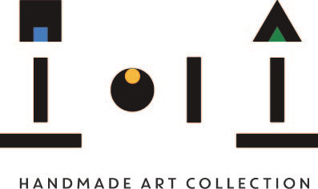
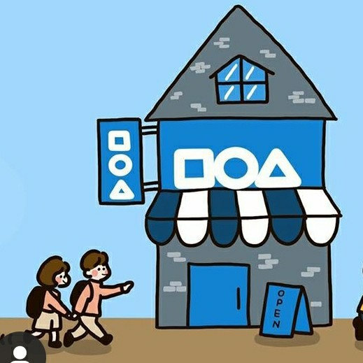

# 모이소 B2B 납품제안서 랜딩페이지 - 사용 방법 가이드

안녕하세요! 코딩 경험이 없으신 분도 쉽게 따라할 수 있도록 상세하게 설명드리겠습니다.

---

## 📁 프로젝트 파일 구조

현재 폴더에는 다음 파일들이 있습니다:

```
납품제안서_랜딩페이지/
├── index.html          (웹페이지의 내용과 구조)
├── style.css           (웹페이지의 디자인)
├── script.js           (웹페이지의 동작 기능)
├── images/             (이미지 폴더)
│   ├── 모이소로고_글자_결과.jpg
│   ├── 모이소로고_도형_결과.jpg
│   ├── 모이소_일러스트그림_결과.jpg
│   └── 작가협업제안서_첫페이지_결과.jpg
└── 사용방법_가이드.md  (이 파일)
```

---

## 🚀 1단계: 웹페이지 실행하기 (가장 간단한 방법)

### 방법 1: 더블클릭으로 실행하기 (추천!)

1. **index.html** 파일을 찾습니다
2. **더블클릭**하면 기본 웹브라우저(크롬, 엣지 등)에서 자동으로 열립니다
3. 완성! 랜딩페이지를 확인할 수 있습니다

### 방법 2: 웹브라우저로 직접 열기

1. 웹브라우저(크롬, 엣지 등)를 실행합니다
2. **index.html** 파일을 브라우저 창으로 **드래그 앤 드롭**합니다
3. 또는 브라우저에서 `Ctrl + O`를 눌러 파일 선택 → index.html 선택

---

## 📱 2단계: 모바일에서 확인하기

### PC에서 모바일 화면 보기

1. 웹브라우저에서 index.html을 엽니다
2. **F12** 키를 누릅니다 (개발자 도구 열림)
3. **Ctrl + Shift + M** 키를 누릅니다 (모바일 모드 전환)
4. 상단에서 다양한 기기를 선택해 확인할 수 있습니다:
   - iPhone 12/13/14
   - Samsung Galaxy
   - iPad
   등

### 실제 모바일 기기에서 보기

**로컬 서버 방법 (Python 사용):**

1. **명령 프롬프트(CMD)** 실행:
   - Windows 검색창에 `cmd` 입력 후 엔터

2. 프로젝트 폴더로 이동:
   ```
   cd "C:\Users\user\OneDrive\문서\Desktop\납품제안서_랜딩페이지"
   ```

3. Python 웹서버 실행:
   ```
   python -m http.server 8000
   ```

4. 브라우저에서 확인:
   - PC: `http://localhost:8000` 접속
   - 모바일: 같은 Wi-Fi에 연결 후 `http://[내PC의IP주소]:8000` 접속

5. PC의 IP 주소 찾기:
   - 명령 프롬프트에서 `ipconfig` 입력
   - IPv4 주소를 확인 (예: 192.168.0.10)

---

## ✏️ 3단계: 내용 수정하기

### 텍스트 수정하는 방법

1. **index.html** 파일을 **메모장** 또는 **VS Code**로 엽니다
   - 메모장: 파일 우클릭 → 연결 프로그램 → 메모장
   - VS Code (추천): 파일 우클릭 → 연결 프로그램 → VS Code

2. 수정하고 싶은 텍스트를 찾아 변경합니다

#### 주요 수정 위치:

**전화번호 변경:**
```html
<!-- 현재 -->
<p><a href="tel:010-6701-4122">010-6701-4122</a></p>

<!-- 변경할 내용을 입력하세요 -->
<p><a href="tel:010-1234-5678">010-1234-5678</a></p>
```

**주소 변경:**
```html
<!-- 현재 -->
<p>제주특별자치도 제주시 신광로8길 14</p>

<!-- 변경할 내용을 입력하세요 -->
<p>변경할 주소를 여기에 입력</p>
```

**메인 캐치프레이즈 변경:**
```html
<!-- Hero Section에서 찾기 -->
<h1 class="hero-title">제주 핸드메이드 소품<br>유통 제안서</h1>
```

3. 파일 저장: `Ctrl + S`
4. 웹브라우저에서 **F5** (새로고침)로 변경 사항 확인

---

## 🎨 4단계: 디자인(색상) 변경하기

### 색상 변경하는 방법

1. **style.css** 파일을 메모장 또는 VS Code로 엽니다

2. 파일 맨 위에 색상 변수가 있습니다:

```css
:root {
    /* 주요 색상 (여기를 수정하세요) */
    --primary-color: #FF9F45;      /* 주황색 (감귤색) */
    --secondary-color: #4A90E2;    /* 파란색 */
    --accent-color: #FFE66D;       /* 노란색 */
    --bg-color: #FFF8F0;           /* 배경 아이보리색 */
    --text-color: #333333;         /* 텍스트 색상 */
}
```

3. 색상 코드를 변경하세요:
   - 색상 코드 찾기: [Google에서 "color picker" 검색](https://www.google.com/search?q=color+picker)
   - 원하는 색상 선택 → HEX 코드 복사 (예: #FF0000)
   - 위의 코드에서 색상 값 변경

4. 파일 저장 후 웹브라우저 새로고침으로 확인

---

## 🖼️ 5단계: 이미지 변경하기

### 이미지 교체 방법

1. 새 이미지를 **images** 폴더에 복사합니다
2. **index.html** 파일에서 이미지 경로를 수정합니다

**로고 이미지 변경:**
```html
<!-- 현재 -->


<!-- 새 이미지 파일명으로 변경 -->

```

**배경 이미지 변경:**
```html


<!-- 변경 -->

```

### 이미지 최적화 팁

- **권장 크기:**
  - 로고: 500px x 200px
  - 배경 이미지: 1920px x 1080px
  - 제품 이미지: 800px x 800px

- **권장 형식:** JPG (사진), PNG (로고/투명배경)

---

## 🌐 6단계: 웹호스팅 (인터넷에 게시하기)

### 무료 호스팅 방법 (추천: Netlify)

#### Netlify 사용 방법:

1. **Netlify 가입:**
   - [https://www.netlify.com](https://www.netlify.com) 접속
   - Sign up (무료 회원가입)
   - GitHub 계정으로 가입 가능

2. **파일 업로드:**
   - 로그인 후 "Sites" 탭 클릭
   - "Add new site" → "Deploy manually" 클릭
   - 프로젝트 폴더 전체를 드래그 앤 드롭
   - (index.html, style.css, script.js, images 폴더 모두 포함)

3. **완성!**
   - 자동으로 웹사이트 주소가 생성됩니다
   - 예: `https://your-site-name.netlify.app`
   - 이 주소를 고객들에게 공유하세요

4. **도메인 연결 (선택사항):**
   - Site settings → Domain management
   - 본인 소유의 도메인 연결 가능 (예: moiso.com)

### 다른 호스팅 옵션:

- **GitHub Pages** (무료): [https://pages.github.com](https://pages.github.com)
- **Vercel** (무료): [https://vercel.com](https://vercel.com)
- **Cafe24** (유료): 한국 호스팅 서비스

---

## 📧 7단계: 문의 폼 연결하기

현재 문의 폼은 테스트용입니다. 실제로 이메일을 받으려면:

### 옵션 1: EmailJS 사용 (무료, 추천)

1. **EmailJS 가입:**
   - [https://www.emailjs.com](https://www.emailjs.com) 접속
   - 무료 회원가입 (월 200건까지 무료)

2. **이메일 서비스 연결:**
   - Gmail, Outlook 등 연결
   - Template 생성

3. **코드 추가:**
   - EmailJS에서 제공하는 코드를 script.js에 추가
   - 상세한 방법: [EmailJS 문서](https://www.emailjs.com/docs/)

### 옵션 2: Google Forms 사용

1. Google Forms에서 폼 생성
2. index.html의 폼 부분을 Google Forms 임베드 코드로 교체

### 옵션 3: 카카오톡/이메일 직접 연결

현재 코드에 이미 포함되어 있습니다:
- 전화 클릭 시 자동 전화 연결
- 카카오톡 버튼 클릭 시 카카오톡 오픈채팅 연결

---

## 🔧 문제 해결 (Troubleshooting)

### 페이지가 제대로 안 보여요

**문제:** 디자인이 깨져 보임
- **해결:**
  1. index.html, style.css, script.js가 모두 같은 폴더에 있는지 확인
  2. 웹브라우저에서 F12 → Console 탭에서 에러 확인

**문제:** 이미지가 안 보임
- **해결:**
  1. images 폴더가 있는지 확인
  2. 이미지 파일명이 정확한지 확인 (대소문자 구분)
  3. 이미지 경로가 올바른지 확인

### 모바일에서 깨져 보여요

**문제:** 모바일에서 레이아웃이 이상함
- **해결:**
  1. 개발자 도구(F12)에서 모바일 모드로 확인
  2. style.css의 반응형 코드가 있는지 확인
  3. 브라우저 캐시 삭제 후 다시 확인

### 스크롤 애니메이션이 작동 안 해요

**문제:** 페이지가 스크롤해도 애니메이션 없음
- **해결:**
  1. 인터넷 연결 확인 (AOS 라이브러리는 CDN 사용)
  2. index.html에 AOS 라이브러리 링크 확인:
     ```html
     <link rel="stylesheet" href="https://unpkg.com/aos@2.3.1/dist/aos.css">
     <script src="https://unpkg.com/aos@2.3.1/dist/aos.js"></script>
     ```

---

## 📚 추가 학습 자료

코딩을 배우고 싶으시다면:

- **HTML/CSS 기초:**
  - [생활코딩](https://opentutorials.org/course/1) - 무료 한국어
  - [W3Schools](https://www.w3schools.com) - 영어

- **YouTube 강의:**
  - "코딩알려주는누나" 채널
  - "드림코딩" 채널

- **추천 에디터:**
  - [VS Code](https://code.visualstudio.com/) - 무료, 가장 인기있는 코드 에디터

---

## 💡 유용한 팁

### 빠른 수정을 위한 검색 방법

1. 메모장이나 VS Code에서 `Ctrl + F` (찾기)
2. 수정하고 싶은 텍스트 검색
3. 해당 위치에서 수정

### 백업하기

변경 전에 항상 백업하세요:
1. 프로젝트 폴더 전체를 복사
2. "백업_날짜" 형식으로 저장
3. 예: `납품제안서_랜딩페이지_백업_20250111`

### 버전 관리

주요 변경사항이 있을 때마다:
- 폴더명에 버전 번호 추가 (v1.0, v1.1, v2.0 등)
- 변경 내용을 메모장에 기록

---

## 📞 추가 도움이 필요하신가요?

이 가이드로도 해결이 안 되는 경우:

1. **Claude Code 재질문:**
   - 구체적인 문제 상황 설명
   - 에러 메시지 스크린샷 제공

2. **온라인 커뮤니티:**
   - [생활코딩 Q&A](https://hashcode.co.kr/)
   - [StackOverflow Korea](https://stackoverflow.com/)

3. **전문가 도움:**
   - 주변 개발자 지인에게 문의
   - 프리랜서 플랫폼에서 간단 수정 의뢰

---

## ✅ 체크리스트

배포 전에 확인하세요:

- [ ] 모든 텍스트 내용이 정확한가요?
- [ ] 전화번호, 이메일, 주소가 올바른가요?
- [ ] 모든 이미지가 제대로 표시되나요?
- [ ] PC에서 정상 작동하나요?
- [ ] 모바일에서 정상 작동하나요?
- [ ] 모든 버튼과 링크가 작동하나요?
- [ ] 문의 폼이 제대로 작동하나요?
- [ ] 로딩 속도가 빠른가요? (3초 이내)

---

## 🎉 축하합니다!

모이소 B2B 납품제안서 랜딩페이지가 완성되었습니다!

이 랜딩페이지는:
- ✅ 반응형 디자인 (모바일, 태블릿, PC 모두 지원)
- ✅ 스크롤 애니메이션 효과
- ✅ FAQ 아코디언
- ✅ 문의 폼
- ✅ 카카오톡 연동
- ✅ SEO 최적화

를 모두 포함하고 있습니다.

성공적인 비즈니스를 기원합니다! 🍊

---

**제작 정보:**
- 프로젝트: 모이소 B2B 납품제안서 랜딩페이지
- 제작일: 2025년 1월
- 제작 도구: Claude Code MVP
- 문의: 010-6701-4122 | 카카오톡: sssongwww
